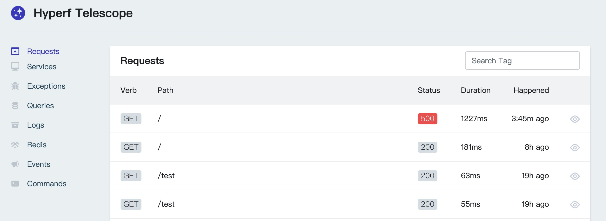
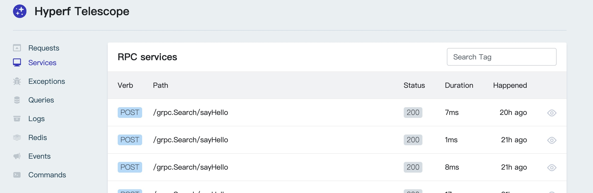
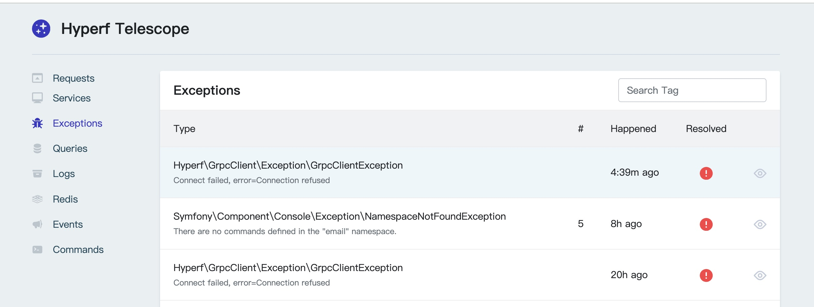

### Hyperf-telescope
hyperf版本的望远镜

### 功能点
- [x] 记录request请求
- [x] 记录异常错误
- [x] 记录sql语句
- [x] 记录grpc service请求
- [x] 记录redis
- [x] 记录log
- [x] 记录command
- [x] 记录event
- [x] 记录http client

### 安装组件
`composer require guandeng/hyperf-telescope:dev-main`

### 发布配置
`php bin/hyperf.php vendor:publish guandeng/hyperf-telescope`

### listeners.php添加监听器( 请求端)
```
<?php

declare(strict_types=1);

return [
    Guandeng\Telescope\Listener\RequestHandledListener::class,
];

```
### middlewares.php添加中间件，该功能属于 beta 版本
```
<?php

declare(strict_types=1);

return [
    'grpc' => [
        Guandeng\Telescope\Middleware\TelescopeMiddleware::class,
    ],
];

```

# 修改.env
```
DB_TELESCOPE_CONNECTION=mysql
DB_TELESCOPE_HOST=127.0.0.1
DB_TELESCOPE_PORT=3306
DB_TELESCOPE_DATABASE=
DB_TELESCOPE_USERNAME=
DB_TELESCOPE_PASSWORD=

TELESCOPE_ENABLED=true #默认关闭
```
### 访问地址

`http://127.0.0.1:9501/telescope/requests`





