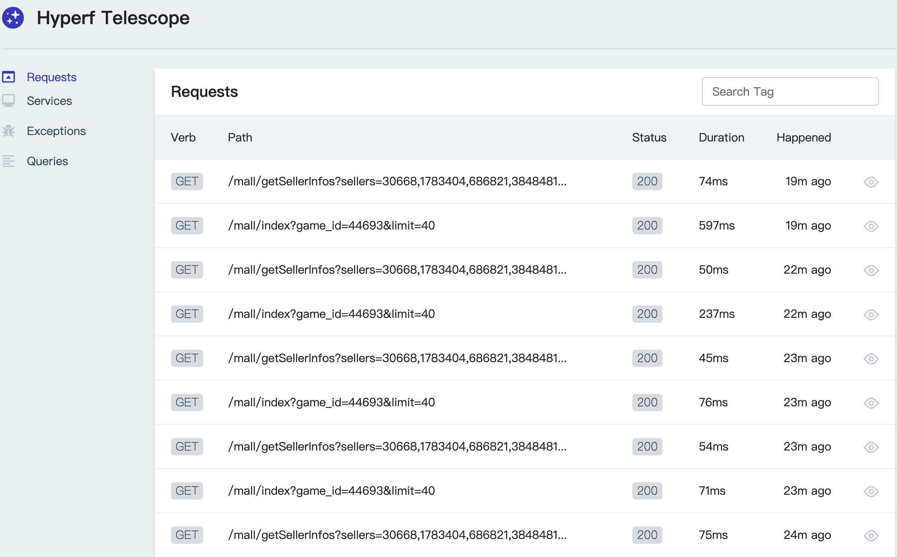

### Hyperf-telescope
hyperf版本的望远镜

### 功能点
- [x] 开箱即用
- [x] 记录request请求
- [x] 记录异常错误
- [x] 记录sql语句
- [x] 记录grpc service请求
- [ ] 记录redis
- [ ] 记录命令
- [ ] 记录event
- [ ] 记录http client

### 安装组件
`composer require guandeng/hyperf-telescope`

### 发布配置
`php bin/hyperf.php vendor:publish guandeng/hyperf-telescope`

### listeners.php添加监听器( 请求端)
```
<?php

declare(strict_types=1);

return [
    Guandeng\Telescope\Listener\RequestHandledListener::class,
];

```
###  对端添加对应中间件(GRPC)，该功能属于 beta 版本
```
<?php

declare(strict_types=1);

return [
    'grpc' => [
        Guandeng\Telescope\Middleware\TelescopeMiddleware::class,
    ],
];


```

### 访问地址
`http://127.0.0.1:9501/telescope/requests`

### 提供配置项
```
# 修改.env
TELESCOPE_ENABLE=true #默认关闭
```

## 效果图

